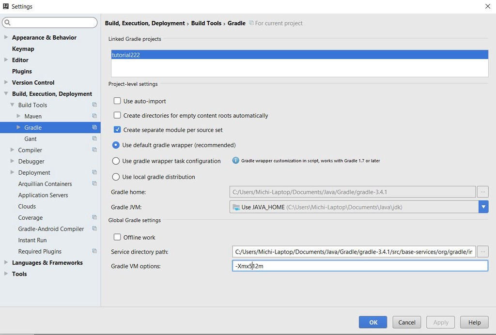

# git und IntelliJ

Ziel dieses Tutorials ist es Sie mit `git` und IntelliJ vertraut zu machen.
Dazu werden Sie
- einen persönlichen _fork_ dieses repositories erstellen,
- das Projekt in IntelliJ auschecken,
- einen eigenen _branch_ erstellen und das Problem beheben
- Ihre Lösung _committen_ und _pushen_, und abschliessend
- den branch mit Ihrer Lösung in `master` _mergen_.

## JDK installieren
Siehe [separate Dokumentatio](docs/win-install-jdk.md).

## git installieren

Windows: siehe [separate Dokumentation](docs/win-install-git.md).

OS X: Sie können auch die [XCode Command Line Tools installieren](http://osxdaily.com/2014/02/12/install-command-line-tools-mac-os-x/).

## Einen fork erstellen
- Öffnen Sie das repository https://inf-git.fh-rosenheim.de/wif-prg2/tutorial, melden Sie sich bei Bedarf mit Ihren Hochschulzugangsdaten an.
- Klicken Sie unter "Project" die Schaltfläche "Fork", um einen privaten fork zu erstellen.

## Clone in IntelliJ
- Starten Sie IntelliJ; sollten Sie noch ein Projekt geöffnet haben, so schließen Sie es bitte.
- Klicken Sie "Checkout from Version Control" und dann "Git".
- Geben Sie die Adresse **Ihres** forks an, z.B. https://inf-git.fh-rosenheim.de/riko493/tutorial (Hinweis: Die URL muss Ihren Accountnamen enthalten!)
- Wählen Sie "Ja" bzw. "Yes" um eine IDEA Struktur anzulegen.
- Wählen Sie im nächsten Fenster ("Import Project") die Option "Import project from external model"..."Gradle".
- Übernehmen Sie im nächsten Fenster alle Standardeinstellungen.

## Fehler finden und beheben
- Navigieren Sie im Projektexplorer (linke Seite) zu `src/test/java/GreetingTest`, und öffnen Sie die Datei.
- Klicken Sie den kleinen grünen Playbutton am linken Rand des Editorfeldes, auf Höhe des Klassennamens, und beobachten Sie die Ausgabe.
- Identifizieren, lokalisieren und beheben Sie das Problem (Hinweis: Die Testklasse soll natürlich **nicht** verändert werden!).
- Verifizieren Sie dass der Test nun positiv durchläuft.

# Branch erstellen, committen und pushen
- Erstellen Sie einen neuen branch, entweder in der Konsole (`git checkout -b <name>`), oder in IntelliJ: Rechts unten am Rand steht "Git: master", klicken Sie dort und wählen Sie "+ Create Branch", und wählen Sie einen Namen, z.B. `loesung`.
- Fügen Sie nun die korrigierten Dateien hinzu, indem Sie auf die Klassendatei mit Rechtsklick das Kontextmenü öffnen, und dann `Git -> Add` wählen.
- Wenn Sie alle Dateien hinzugefügt haben, wählen Sie in der Menüleiste `VCS -> Commit Changes`, um die Änderungen zu committen.
- Fügen Sie eine Nachricht hinzu, und wählen Sie "Commit and Push" (bewegen Sie dazu die Maus auf "Commit", es erscheint ein PopUp)

## Branch verifizieren und mergen
- Navigieren Sie zu Ihrem fork, und klicken Sie auf "Pipelines".
- Vergewissern Sie sich, dass der commit gepusht wurde (also auf dem Server ist), und dass der Test "grün" wird (_passed_).
- Klicken Sie nun auf "Repository", und anschließend darunter auf "Branches"
- Klicken Sie nun für Ihren Branch auf die Schaltfläche "Compare", um die Änderungen zum `master` branch zu begutachten.
- Klicken Sie nun rechts oben auf "Create Merge Request" um den merge einzuleiten; geben Sie eine Beschreibung und klicken Sie die grüne Schaltfläche "Submit merge request".
- Auf der nächsten Seite (bzw. unter "Merge Reuqests") können Sie den merge request bestätigen, und so die Änderungen in Ihren `master` branch einbringen.

Gratulation! Sie haben Ihre erste Lösung eingebracht!

## Hinweise zu IntelliJ auf Windows
- Es kann sein, dass Sie die Speichereinstellung für die virtuelle Maschine ändern müssen:
    
- https://www.jetbrains.com/help/idea/2016.3/working-with-embedded-local-terminal.html
- http://stackoverflow.com/questions/21676150/setup-git-in-intellij-terminal
